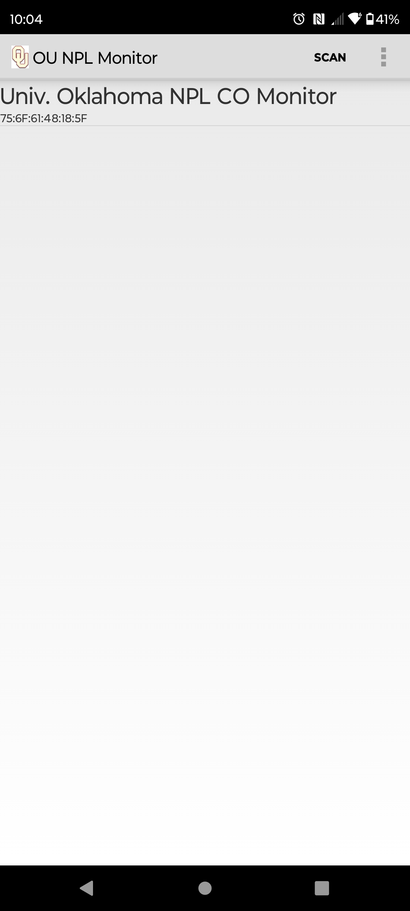
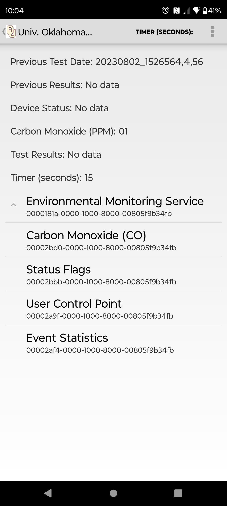

Bluetooth Low Energy (BLE) Gatt Client
===================================

Code derived from Google Android Developers Example how to use the Bluetooth LE Generic Attribute Profile (GATT)
to transmit arbitrary data between devices.

Introduction
------------

Initial code used to receive Heart Rate Measurement service, changed to "Environmental Sensing".
Both terms may appear in the code but refer to the "main" service.

It creates a [Service][1] for managing connection and data communication with a GATT server
hosted on a given Bluetooth LE device.

The Activities communicate with the Service, which in turn interacts with the [Bluetooth LE API][2].

[1]:http://developer.android.com/reference/android/app/Service.html
[2]:https://developer.android.com/reference/android/bluetooth/BluetoothGatt.html

Pre-requisites
--------------

- Android SDK 28
- Android Build Tools v28.0.3
- Android Support Repository

Screenshots
-------------

  

Getting Started
---------------

This sample uses the Gradle build system. To build this project, use the
"gradlew build" command or use "Import Project" in Android Studio.

